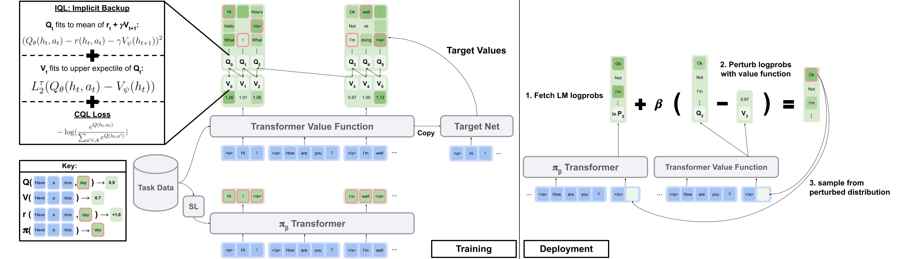
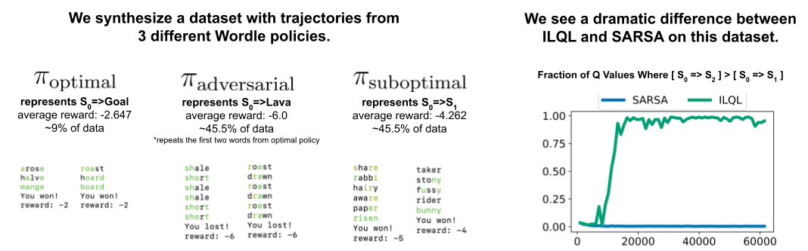
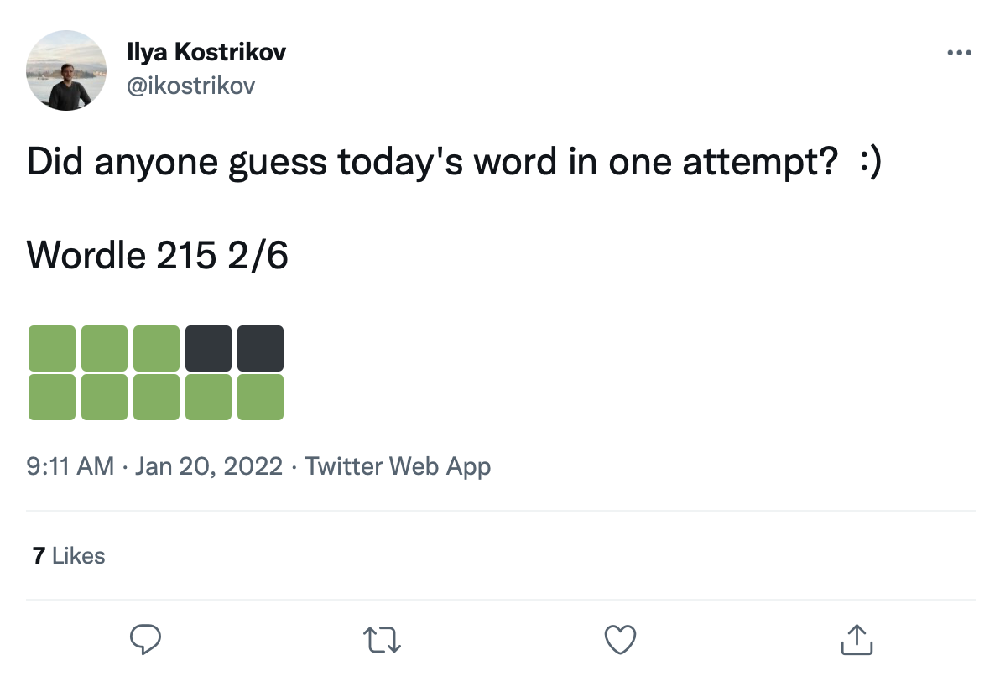

# Implicit Language Q Learning

Official code from the paper "Offline RL for Natural Language Generation with Implicit Language Q Learning"

[project site](https://sea-snell.github.io/ILQL_site/) | [arxiv]()



# Setup

### **Preprocessed Data**

Download the data zip from the Google drive folder [here](https://drive.google.com/drive/folders/1ltO6e4sP3waGPJoGFGuiHt7mJt8_2eP3?usp=sharing). Place the downloaded and unzipped folder, "data", at the root of the repo.

### **Dependencies and PYTHONPATH**

This repo was designed for python 3.9.7

``` shell
pip install -r requirements.txt
export PYTHONPATH="$PWD/src/"
```

### **Visual Dialogue Environment**

To run the Visual Dialogue experiments, you need to serve the Visual Dialogue environment on localhost by following the instructions [here](https://github.com/Sea-Snell/visdial-rl).

### **Toxicity Filter Reward**

To run the Reddit comment experiments with the toxicity filter reward:

1. create an account for the GPT-3 API [here](https://openai.com/api/)
2. `export OPENAI_API_KEY=your_API_key`

# Running Experiments

`scripts/` contains all experiment scripts. To run any script in `scripts/`:
1. Navigate to the script's directory.
2. `python script_name.py`

Optional:
* Edit the config file corresponding to the script as you desire.
* Provide commandline args [hydra](https://hydra.cc/docs/intro/) style like: `python script_name.py eval.bsize=5 train.lr=1e-6 wandb.use_wandb=false`
* Run data parallel training or evaluation on multiple GPUs like: `python -m torch.distributed.launch --nproc_per_node [N_GPUs] --use_env script_name.py arg1=a arg2=b`

By default all training scripts log to wandb. To turn this off, set `wandb.use_wandb=false` in the training config.

### **Recommended Experiment Workflow:**

Here I outline a recommended workflow for training offline RL agents. Suppose that I want to train a bunch of different offline RL agents to generate Reddit comments with the toxicity reward.

I would first train a BC model on the data:

``` shell
cd scripts/train/toxicity/
python train_bc.py
```

Then convert this BC checkpoint into one compatible with the offline RL models:

``` shell
cd ../data/
python convert_bc.py --load ../../outputs/toxicity/conditional_toxicity_official_bc_test1/model.pkl --save ../../outputs/toxicity/conditional_toxicity_official_bc_test1/model_converted.pkl
```

Then edit the checkpoint that offline RL is configured to train with:

``` shell
cd ../train/
python train_iql.py model.load.checkpoint_path=outputs/toxicity/model_converted.pkl model.load.strict_load=false train.loss.awac_weight=0.0
```

This is just one workflow though, you can also train the BC model at the same time as the offline RL agent by setting `train.loss.awac_weight=1.0` in the training config.

# Repo Overview

* All data is provided pre-processed in the `data/` folder.
* `scripts/` contains all scripts for running training, evaluation, and data pre-processing steps in the paper. Scripts are organized into subfolders corresponding to the dataset used.
* `config/` contains .yaml configs for each script. This reop uses [hydra](https://hydra.cc/docs/intro/) to manage configs. Configs are organized into subfolders corresponding to the dataset used. Most config files are named the same as their corresponding script, but if you are unsure which config corresponds to a script, check the line `@hydra.main(config_path="some_path", config_name="some_name")` to see which config file the script corresponds to.
* `src/` contains all the core implementations. See `src/models/` for all model implementations. See `src/data/` for all base data processing and MDP abstraction code. See `src/utils/` for various utility functions. See `src/wordle/`, `src/visdial`, and `src/toxicity/` for all Wordle, Visual Dialogue, and Reddit comment dataset specific code respectively.
* `ILQL` is referred to as `iql` throughout the repo.

## Config Framework Overview

Each script is associated with a config file. The config file specifies which models, dataset, and evaluators are to be loaded by the script and their corresponding hyperaprameters. See `configs/toxicity/train_iql.yaml` for an example.

Each possible model, dataset, or evaluator object is given its own config file, which specifies default values for that object and a special `name` attribute, which tells the config manager what class to load. See `configs/toxicity/model/per_token_iql.yaml` for an example.

The files `src/load_objects.py`, `src/wordle/load_objects.py`, `src/visdial/load_objects.py`, and `src/toxicity/load_objects.py` define how each object is loaded from its corresponding config. The `@register('name')` tag above each load object function links to the `name` attribute in the config.

You may notice a special `cache_id` attribute associated with some objects in a config. For an example, see `train_dataset` in `configs/toxicity/train_iql.yaml`. This attribute tells the config manager to cache the first object that it loads that is associated with this id, and then to return this cached object for subsequent object configs with this cache_id.

For all configs, use paths reletive to the repo root.

## A Few Abstrations to be Aware of

Each of the tasks in our repo – Wordle, Visual Dialogue, and Reddit comments – implements a few base classes. Once implemented, all the offline RL algorithms can be applied to the task in a plug-and-play manner. See the "Creating Your Own Tasks" section for an overview of what should be implemented in order to create your own tasks. Below, we outline the key abstraction that make this possible.

* `data.language_environment.Language_Environment` – represents a task POMDP environment, which a policy can interact with. It has a gym-like interface.
* `data.language_environment.Policy` – represents a policy which can interact with an environment. Each of the offline RL algorithms in `src/models/` has a corresponding a policy.
* `data.language_environment.Language_Observation` – represents a text observation that is returned by the environment and given as input to a policy.
* `data.language_environment.interact_environment` – a function which takes in an environment, a policy, and optionally the current observation and runs an environment interaction loop. If the current observation is not provided, it automatically fetches an initial state by resetting the environment.
* `data.rl_data.DataPoint` – defines a standardized data format that is fed as input to all offline RL agents on all tasks. These data structures are created automatically from a given `Language_Observation`.
* `data.rl_data.TokenReward` – defines a reward function given at every single token, which can be used for learning more finegrained control. This is provided on top of the environment's reward, which comes not at every token but instead after each turn of interaction. In all our experiments we set this reward to a constant 0, such that it has no effect.
* `data.tokenizer.Tokenizer` – specifies how to convert strings to and from sequences to tokens which can be fed as input to language models.
* `data.rl_data.RL_Dataset` – defines a dataset object which returns `DataPoint` objects and is used for training offline RL agents. There are two versions of `RL_Dataset`:
    1. `List_RL_Dataset`
    2. `Iterable_RL_Dataset`

# Wordle Task


Here we outline and document all the components of our Wordle task.

Much of what is in the example scripts is done automatically by the config manager, and the corresponding parameters can be edited by changing the configs. But if you want to bypass using the configs and use the Wordle Task with your own codebase, you can reference the scripts and documentation below for how to do this.

### **Playing Wordle:**

A simple example script for playing Wordle in the commandline.

``` python
from wordle.wordle_env import WordleEnvironment
from wordle.wordle_game import Vocabulary
from wordle.policy import UserPolicy
from data.language_environment import interact_environment
from utils.misc import convert_path

game_vocab = Vocabulary.from_file(convert_path('data/wordle/word_lists/wordle_official.txt'))
env = WordleEnvironment(game_vocab)
policy = UserPolicy()

interact_environment(env, policy)
```

## Code Overview:

* Wordle game implementation: `src/wordle/wordle_game.py`
* Wordle gym-like environment: `src/wordle/wordle_env.py`
* A set of handcrafted Wordle policies: `src/wordle/policy.py`
* Dataset classes that load Wordle games from a file, sample games from a given policy, or load games from Twitter data: `src/wordle/wordle_dataset.py`

To make the game a valid MDP, the environment represents the underlying state as a set of known letter constraints, and uses these to filter the vocabulary for words that meet all of these constraints at each turn. A random word is then selected from this filtered word list and used to determine the color transitions returned by the environment. These new color transitions, then update the set of known letter constraints.

## Word Lists:

The Wordle environment takes in a word list. A few word lists are given in `data/wordle/word_lists/`, but feel free to make your own.

The word lists included are:
* tweet_words.txt: a set of daily words corresponding to the days the that the Wordle Tweets were scraped.
* wordle_official.txt: the official word list for the pre-NYT version of the game. Taken from [here](https://gist.github.com/cfreshman/a03ef2cba789d8cf00c08f767e0fad7b).
* wordle_official_200.txt: a random subset of 200 words from wordle_official.txt unioned with the words in tweet_words.txt, for retrofitting onto Tweet data.
* wordle_official_400.txt: the same as wordle_official_200.txt, but with a random subset of 400 words instead.
* wordle_official_800.txt: the same as wordle_official_200.txt, but with a random subset of 800 words instead.
* wordle_official_guess.txt: the official list of allowable guess words in the pre-NYT version of the game.
* 10k_words.txt: from [MIT's 10000 words list](https://www.mit.edu/~ecprice/wordlist.10000).
* large_words.txt: a massive list of words taken from [here](https://github.com/dwyl/english-words/blob/master/words_alpha.txt).

## Vocabulary:

The word lists are loaded into the environment through a `Vocabulary` object as in the example above.

``` python
from wordle.wordle_game import Vocabulary
from utils.misc import convert_path

vocab = Vocabulary.from_file(convert_path('data/wordle/word_lists/wordle_official.txt'))
```

The vocabulary stores not just the word list, but also keeps track of a filtered list of words that meet all the known letter constraints in a given state. This list is used to compute transitions in the environment and is used by some of the hand crafted policies.

Producing these filtered lists in real time can slow the environment interaction process. This shouldn't normally be an issue, but if you want to quickly synthesize lots of data from a policy, then this may become a bottleneck. To overcome this, all `Vocabulary` objects store a `cache` argument, which caches these filtered word lists associated with a given state. `vocab.cache.load(f_path)` and `vocab.cache.dump()` enables loading and saving this cache. For example, `data/wordle/vocab_cache_wordle_official.pkl` is a large cache for the wordle_official.txt word list.

Beyond storing a cache, the `Vocabulary` object implements following methods:

#

#### **`__init__`**

``` python
def __init__(self, all_vocab: List[str], 
             wordle_state: Optional[WordleState], 
             cache: Optional[Cache]=None, 
             fill_cache: bool=True)
```
**Inputs:**
* `all_vocab: List[str]` – a list of words.
* `wordle_state: Optional[WordleState]` – a state from which to generate the filtered word list, if no state is provided, no words are filtered.
* `cache: Optional[Cache]=None` – a cache for the filtered vocab, as described above.
* `fill_cache: bool=True` – whether to add to the cache.

**Returns:** `None`

#

#### **`from_file`**

``` python
def from_file(cls, vocab_file: str, fill_cache: bool=True)
```

**Inputs:**
* `vocab_file: str` – a file from which to load the words. The method only selects the words that are 5 letters long.
* `fill_cache: bool=True` – whether to add to the cache.

**Returns:** `Vocabulary`

#

#### **`filtered_vocab_size`**

``` python
def filtered_vocab_size(self)
```

**Returns:** The size of the filtered vocabulary

#

#### **`all_vocab_size`**

``` python
def all_vocab_size(self)
```

**Returns:** The size of the full unfiltered vocabulary

#

#### **`get_random_word_filtered`**

``` python
def get_random_word_filtered(self)
```

**Returns:** A random word from the filtered list.

#

#### **`get_random_word_all`**

``` python
def get_random_word_all(self)
```

**Returns:** A random word from the full unfiltered list.

#

#### **`update_vocab`**

``` python
def update_vocab(self, wordle_state: WordleState)
```

**Inputs:**
* `wordle_state: WordleState` – a Wordle state object, representing the set of known letter constraints.

**Returns:** A new `Vocabulary` object, which is filtered according to `wordle_state`.

#

#### **`__str__`**

``` python
def __str__(self) -> str
```

**Returns:** A string representation of the filtered word list for printing to the terminal.

#

## Wordle Environment:

`WordleEnvironment` takes a Vocabulary object as input, which defines the set of possible correct words in the environment.

``` python
from wordle.wordle_env import WordleEnvironment
from wordle.wordle_game import Vocabulary
from utils.misc import convert_path

vocab = Vocabulary.from_file(convert_path('data/wordle/word_lists/wordle_official.txt'))
env = WordleEnvironment(vocab)

initial_obs = env.reset()
next_obs, reward, terminal = env.step("snake")
```

As shown above, the environment has a gym-like interface:

#

#### **`__init__`**

``` python
def __init__(self, vocab: Vocabulary)
```

**Inputs:**
* `vocab: Vocabulary` – the environment's vocabulary

**Returns:** `None`

#

#### **`step`**

``` python
def step(self, action: str) -> Tuple[WordleObservation, float, bool]
```

**Inputs:**
* `action: Vocabulary` – the environment's vocabulary

**Returns:** an (observation, reward, terminal) tuple.

#

#### **`reset`**

``` python
def reset(self) -> WordleObservation
```

**Returns:** an observation

#

#### **`is_terminal`**

``` python
def is_terminal(self) -> bool
```

**Returns:** a boolean indicating if the interaction has terminated.

#

## Hand Crafted Wordle Policies:

We implement a set of hand-crafted Wordle policies that cover a range of gameplay levels. All of these are implemented in `src/wordle/policy.py`. Here we describe each one:

#

#### **`UserPolicy`**

``` python
from wordle.policy import UserPolicy

policy = UserPolicy(hint_policy=None, vocab=None)
```

**Description:**

Let's you play in the terminal.

**Inputs:**
* `hint_policy: Optional[Policy]` – another policy to query if you want a hint on what word to use.
* `vocab: Optional[Union[str, Vocabulary]]` – a Vocabulary of guessable words. If not specified, any 5 letter sequence of chars is a valid guess.

#

#### **`StartWordPolicy`**

``` python
from wordle.policy import StartWordPolicy

policy = StartWordPolicy()
```

**Description:**

To be applied only for the first word. Selects a word randomly from a list of curated, high quality start words.

**Inputs:**
* `start_words: Optional[List[str]]=None` – override the curated list of start words.

#

#### **`OptimalPolicy`**

``` python
from wordle.policy import OptimalPolicy

policy = OptimalPolicy()
```

**Description:**

Myopically plays the highest information gain word from the word list that meets all known letter constraints. This policy is not actually optimal, as [optimal play is NP-hard](https://arxiv.org/abs/2203.16713). But it plays at an extremely high level, and can be used as an approximate upper bound for performance. This policy is very slow to compute, with performance quadratic in the size of the word list; to save computations, `self.cache.load(f_path)` and `self.cache.dump()`allows you to load and save a cache. For example, `data/wordle/optimal_policy_cache_wordle_official.pkl` represents a cache for this policy on the `wordle_official.txt` word list.

**Inputs:**
* `start_word_policy: Optional[Policy]=None` – since the first word is generally the most expensive to compute information gain for, this allows you to specify a different policy to be called for just the first word.
* `progress_bar: bool=False` – since it can take so long to compute, we leave you the option of displaying a progress bar for each call to `self.act`.

#

#### **`RepeatPolicy`**

``` python
from wordle.policy import RepeatPolicy

policy = RepeatPolicy(start_word_policy=None, first_n=2)
```

**Description:**

Randomly repeats one of the `first_n` words already used. This is a maximally suboptimal policy, since it can never win unless it gets lucky on the first word.

**Inputs:**
* `start_word_policy: Optional[Policy]` – a policy to use for choosing the first word. If `None`, then randomly select a word from the environment's vocabulary.
* `first_n: Optional[int]` – the policy randomly selects the next word from the `first_n` words in the history. If `None`, then it selects randomly from the full history.

#

#### **`RandomMixturePolicy`**

``` python
from wordle.policy import RandomMixturePolicy

policy = RandomMixturePolicy(prob_smart=0.5, vocab=None)
```

**Description:**

Chooses a word fully at random from a word list with probability `(1 - prob_smart)` and chooses a random word from the word list that meets all known letter constraints with probability `prob_smart`.

**Inputs:**
* `prob_smart: float` – the proability of selecting a word that meets all known letter constraints, rather than one fully at random.
* `vocab: Optional[Union[str, Vocabulary]]` – a word list to select from. If `None`, then the policy defaults to the environment's word list.

#

#### **`WrongPolicy`**

``` python
from wordle.policy import WrongPolicy
from wordle.wordle_game import Vocabulary


vocab = Vocabulary.from_file('data/wordle/word_lists/wordle_official.txt')
policy = WrongPolicy(vocab)
```

**Description:**

Randomly chooses a word from a word list that fails to meet all known letter constraints and thus cannot be the correct word. If all words in the word list meet the letter constraints, then it chooses a word a random from the list. This policy is highly suboptimal.

**Inputs:**
* `vocab: Union[str, Vocabulary]` – a word list to choose from.

#

#### **`MixturePolicy`**

``` python
from wordle.policy import MixturePolicy, OptimalPolicy, RandomMixturePolicy

policy1 = OptimalPolicy()
policy2 = RandomMixturePolicy(prob_smart=0.5, vocab=None)
policy = MixturePolicy(prob1=0.5, policy1=policy1, policy2=policy2)
```

**Description:**

Mixes two given policies. Select from `policy1` with probability `prob1` and select from `policy2` with probability `(1 - prob1)`.

**Inputs:**
* `prob1: float` – the probability of selecting an action from `policy1`.
* `policy1: Policy` – the first policy to select actions from. Selected with probability `prob1`.
* `policy1: Policy` – the second policy to select actions from. Selected with probability `(1 - prob1)`.

#

#### **`MonteCarloPolicy`**

``` python
from wordle.policy import MonteCarloPolicy

sample_policy = RandomMixturePolicy(prob_smart=0.5, vocab=None)
policy = MonteCarloPolicy(n_samples=5, sample_policy=sample_policy)
```

**Description:**

Takes in a policy, runs `n_samples` of Monte Carlo rollouts in the environment, and selects the next action which recieved the highest average reward during the rollout process.

**Inputs:**
* `n_samples: int` – the number of Monte Carlo rollouts to execute.
* `sample_policy: Policy` – the policy to sample rollouts from.

#

## Synthetic Wordle Data



Any of the above policies can be used to generate datasets, which can be used to train offline RL agents. We implement two kinds of synthetic datasets:
1. `wordle.wordle_dataset.WordleListDataset` – loads Wordle games from a file.
2. `wordle.wordle_dataset.WordleIterableDataset` – samples wordle games from a given policy.

### **`WordleListDataset`:**
Load a Wordle dataset from a file like so:

``` python
from wordle.wordle_dataset import WordleListDataset
from data.rl_data import ConstantTokenReward

data = WordleListDataset.from_file(
    file_path='data/wordle/expert_wordle_100k.pkl', 
    max_len=None, 
    vocab=None, 
    token_reward=ConstantTokenReward(0.0), 
)

for i in range(data.size()):
    item = data.get_item(i)
```

#

#### **`__init__`**

``` python
def __init__(self, items: List[Tuple[WordleObservation, Optional[Dict[str, Any]]]], max_len: Optional[int], token_reward: TokenReward) -> None
```

**Inputs:**
* `items: List[Tuple[WordleObservation, Optional[Dict[str, Any]]]]` – A list of data in the form of tuples of (WordleObservation, metadata_dict). Where metadata_dict is any sort of metadata is any sort of metadata you might want to store in the DataPoint.
* `max_len: Optional[int]` – the maximum sequence length in the dataset, will truncate all token sequences to this length. If `None`, then sequences will not be truncated.
* `token_reward: TokenReward` – the token-level reward to apply to the sequences. We use a constant reward of 0 per-token for all experiments.

**Returns:** `None`

#

#### **`from_file`**

``` python
def from_file(cls, file_path: str, max_len: Optional[int], vocab: Optional[Vocabulary], token_reward: TokenReward)
```

**Inputs:**
* `file_path: str` – the path to the data pickle file.
* `max_len: Optional[int]` – the maximum sequence length in the dataset, will truncate all token sequences to this length. If `None`, then sequences will not be truncated.
* `vocab: Optional[Vocabulary]` – simulate the dataset under a different  environment vocabulary. If `None`, defaults to using the same vocabulary that was used to create the dataset.
* `token_reward: TokenReward` – the token-level reward to apply to the sequences. We use a constant reward of 0 per-token for all experiments.

**Returns:** a `WordleListDataset` object.

#

#### **`get_item`**

``` python
def get_item(self, idx: int)
```

**Inputs:**
* `idx: int` – an index in the dataset.

**Returns:** a `DataPoint` object.

#

#### **`size`**

``` python
def size(self)
```

**Returns:** the size of the dataset.

#

The following scripts in `scripts/data/wordle/` can be used to synthesize Wordle data.

| script      | description |
| ----------- | ----------- |
| `generate_data.py` | Samples a number of games from a given policy specified in the config and saves them to a file. |
| `generate_data_mp.py` | The same as `generate_data.py` except samples games in parallel on multiple processes. |
| `generate_adversarial_data.py` | synthesizes the dataset described in Section 5 of our paper, which was designed to demonstrate the difference between single-step RL methods and multi-step ones. |
| `generate_adversarial_data_mp.py` | The same as `generate_adversarial_data.py` except samples games in parallel on multiple processes. |
| `generate_data_branch.py` | Samples games from a given "expert" policy and then from each action in the game, a "suboptimal" policy branches off sampling a new game. |
| `generate_data_branch_mp.py` | The same as `generate_data_branch.py` except samples games in parallel on multiple processes. |

#

Some provided synthetic Wordle datasets are in `data/wordle/`.

| file      | description |
| ----------- | ----------- |
| `expert_wordle_100k.pkl` | 100k games sampled from `OptimalPolicy`. |
| `expert_wordle_mp_100k.pkl` | Another 100k games sampled from the `OptimalPolicy`. |
| `expert_wordle_adversarial_20k.pkl` | The dataset described in Section 5 of our paper, which was designed to demonstrate the difference between single-step RL methods and multi-step ones. |
| `expert_wordle_branch_100k.pkl` | 100k games sampled using `generate_data_branch.py` from `OptimalPolicy` with the branches sampled from `WrongPolicy`. |
| `expert_wordle_branch_150k.pkl` | Another 150k games sampled using `generate_data_branch.py` from `OptimalPolicy` with the branches sampled from `WrongPolicy`. |
| `expert_wordle_branch_2k_10sub.pkl` | 2k games sampled using `generate_data_branch.py` from `OptimalPolicy` with 10 branches per action sampled from `WrongPolicy`, such that there is much more suboptimal data than in `expert_wordle_branch_100k.pkl`. |
| `expert_wordle_branch_20k_10sub.pkl` | The same as `expert_wordle_branch_2k_10sub.pkl` except 20k games instead of 2k games. |

### **`WordleIterableDataset`:**

Generate Wordle data sampling from a policy like so:

``` python
from wordle.wordle_dataset import WordleIterableDataset
from wordle.policy import OptimalPolicy
from data.rl_data import ConstantTokenReward

policy = OptimalPolicy()
vocab = Vocabulary.from_file('data/wordle/word_lists/wordle_official.txt')
data = WordleIterableDataset(
    policy=policy, 
    vocab=vocab, 
    max_len=None, 
    token_reward=ConstantTokenReward(0.0), 
)

while True:
    item = data.sample_item()
```

#

#### **`__init__`**

``` python
def __init__(self, policy: Policy, vocab: Vocabulary, max_len: Optional[int], token_reward: TokenReward) -> None
```

**Inputs:**
* `policy: Policy` – a policy to sample from.
* `vocab: Vocabulary` – the environment's vocabulary.
* `max_len: Optional[int]` – the maximum sequence length in the dataset, will truncate all token sequences to this length. If `None`, then sequences will not be truncated.
* `token_reward: TokenReward` – the token-level reward to apply to the sequences. We use a constant reward of 0 per-token for all experiments.

**Returns:** `None`

#

#### **`sample_item`**

``` python
def sample_item(self)
```

**Returns:** a `DataPoint` object.

#

## Wordle Tweet Data:

We have a large dataset of over 200k Tweets of Wordle games like this:


</br>

We can retrofit Words onto these color transition squares to create a real dataset of Wordle games.

### **Preprocessing the Tweet Data:**

The raw Tweet data is given in `data/wordle/tweets.csv`, but in order to be usable, actual words need to be retrofitted onto the color squares in the Tweets. Performing this retrofitting process requires executing a preprocessing script which caches all possible color transitions under two vocab lists: 1) a set of guessable words, and 2) a set of possible correct words in an environment. The result is a datastructure that `wordle.wordle_dataset.WordleHumanDataset` uses to synthesize valid wordle games from the Tweets. This script is `scripts/data/wordle/build_human_datastructure.py`. Call the script like:

``` shell
cd scripts/data/wordle/
python build_human_datastructure.py --guess_vocab=../../../data/wordle/word_lists/wordle_official.txt --correct_vocab=../../../data/wordle/word_lists/wordle_official.txt --tweets_file=../../../data/wordle/tweets.csv --output_file=../../../data/wordle/random_human_tweet_data.json
```

The script's args:
* `--guess_vocab` specifies the set of guessable words.
* `--correct_vocab` specifies the set of possible corrext words in an environment.
* `--tweets_file` specifies the raw csv file of Tweets
* `--output_file` specifies where to dump the output.

### **Loading the Tweet Data:**

We've run the preprocessing on some of the word lists, with the results saved in `data/wordle/`.

| word list      | preprocessed Tweet data file |
| ----------- | ----------- |
| `wordle_official.txt` | `random_human_tweet_data.json` |
| `wordle_official_800.txt` | `random_human_tweet_data_800.json` |
| `wordle_official_400.txt` | `random_human_tweet_data_400.json` |
| `wordle_official_200.txt` | `random_human_tweet_data_200.json` |
| `tweet_words.txt` | `human_tweet_data_true_word.json` |


Given one of these files you can load the Wordle Tweet dataset like so:

``` python
from wordle.wordle_dataset import WordleHumanDataset

data = WordleHumanDataset.from_file('data/wordle/random_human_tweet_data_200.json')

print(data.sample_item())
```

We used `'data/wordle/random_human_tweet_data_200.json'` in our experiments.

### **`WordleHumanDataset`:**

#

#### **`__init__`**

``` python
def __init__(self, games: List[Tuple[str, List[str]]], transitions: Dict[str, Dict[str, List[str]]], use_true_word: bool, max_len: Optional[int], token_reward: TokenReward, game_indexes: Optional[List[int]], top_p: Optional[float]) -> None
```

**Inputs:**
* `games: List[Tuple[str, List[str]]]` – a list of tuples of the form `(correct_wordle_word, wordle_transitions_list)`, where `wordle_transitions_list` is a list of transitions indicating the colors in the Tweet like: `["<b><b><y><y><b>", "<g><b><b><b><b>", "<g><g><y><b><b>", "<g><g><g><g><g>"]`.
* `transitions: Dict[str, Dict[str, List[str]]]` – a dict mapping the correct wordle word to another dict mapping possible color transitions that could have been induced by that word to a list of words that could have been played to cause that transition. This datastrcutre is used to retrofit words onto the Tweets.
* `use_true_word: bool` – if `True`, use the ground-truth correct word from the tweet, else retrofit any correct word in the word list that works.
* `max_len: Optional[int]` – the maximum sequence length in the dataset, will truncate all token sequences to this length. If `None`, then sequences will not be truncated.
* `token_reward: TokenReward` – the token-level reward to apply to the sequences. We use a constant reward of 0 per-token for all experiments.
* `game_indexes: Optional[List[int]]` – a list of indexes to create a split of the Tweets. If `None`, all items in the data will be used. We have `data/wordle/human_eval_idxs.json` and `data/wordle/human_train_idxs.json` created as randomly selected train and eval splits.
* `top_p: Optional[float]` – filter for the `top_p` performing percent of the data. If `None`, no data will be filtered. Used for %BC models.

**Returns:** `None`

#

#### **`from_file`**

``` python
def from_file(cls, file_path: str, use_true_word: bool=False, max_len: Optional[int]=None, token_reward: Optional[TokenReward]=None, top_p: Optional[float]=None)
```

**Inputs:**
* `file_path: str` – the path to the json file to load the data from.
* `use_true_word: bool` – if `True`, use the ground-truth correct word from the tweet, else retrofit any correct word in the word list that works.
* `max_len: Optional[int]` – the maximum sequence length in the dataset, will truncate all token sequences to this length. If `None`, then sequences will not be truncated.
* `token_reward: TokenReward` – the token-level reward to apply to the sequences. We use a constant reward of 0 per-token for all experiments.
* `game_indexes: Optional[List[int]]` – a list of indexes to create a split of the Tweets. If `None`, all items in the data will be used. We have `data/wordle/human_eval_idxs.json` and `data/wordle/human_train_idxs.json` created as randomly selected train and eval splits.
* `top_p: Optional[float]` – filter for the `top_p` performing percent of the data. If `None`, no data will be filtered. Used for %BC models.


**Returns:** a `WordleHumanDataset` object.

#

#### **`sample_item`**

``` python
def sample_item(self)
```

**Returns:** a `DataPoint` object.

#

## Wordle Training and Evaluation Scripts

Training scripts are in `scripts/train/wordle/`.

| script      | description |
| ----------- | ----------- |
| `train_bc.py` | Train a BC agent. |
| `train_iql.py` | Train an ILQL agent. |

Evaluation scripts are in `scripts/eval/wordle/`.

| script      | description |
| ----------- | ----------- |
| `eval_policy.py` | Evaluate a BC or ILQL agent in the Wordle environment. |
| `eval_q_rank.py` | An evaluation script for comparing the reletive rank of Q values for agents trained on the synthetic dataset describd in Section 5 of our paper, which was designed to demonstrate a difference between single-step RL and multi-step RL. |
| `distill_policy_eval.py` | Prints out result of `eval_policy.py` with error bars. |

# Visual Dialogue Question Asking Task

Here we outline how to load the [Visual Dialogue](https://visualdialog.org) data in our codebase and how to execute the environment. See the setup section above for how to setup the remote components of the Visual Dialogue environment. The data and environment objects are loaded automatically in by the config manager, but if you want to by-pass the config system, here's how you should load, execute, and configure these objects. The same settings described below can all be modified in the configs as well.

### **Loading the Visual Dialogue Data**

An example script for loading the VisualDialogue dataset

``` python
from visdial.visdial_base import VisDialogueData

data = VisDialogueData(
    data_path='data/vis_dialogue/raw/visdial_0.5/visdial_0.5_train.json',
    img_feat_path='data/vis_dialogue/processed/visdial_0.5/data_img.h5',
    split='train',
    reward_cache='data/vis_dialogue/processed/visdial_0.5/train_rank_reward_cache1.json',
    yn_reward_kind='none'
)

for i in range(len(data)):
    print(data[i])
```

The above script corresponds to how we configured the dataset for our 'standard' reward experiments, but if you want to configure the dataset differently, there are many arguments you can modify. Beyond just changing the dataset split, these arguments can also change the task or reward. Below we describe all the different configurable parameters that `VisDialogueData` takes.

* `data_path: str` – the path to the dialogue data. Should be one of:
    1. `data/vis_dialogue/raw/visdial_0.5/visdial_0.5_train.json`
    2. `data/vis_dialogue/raw/visdial_0.5/visdial_0.5_val.json`
    3. `data/vis_dialogue/raw/visdial_0.5/visdial_0.5_test.json`
* `img_feat_path: str` – the path to the image features used to compute the reward for each dialogue. Should always be `data/vis_dialogue/processed/visdial_0.5/data_img.h5`.
* `split: str` – one of `train`, `val`, or `test`. Indicates which dataset split of the image features to use. Should be consistent with the `data_path` split.
* `reward_cache: Optional[str]=None` – where the rewards for each dialogue are stored. If `None`, it will set all rewards to `None`. We provide caches for two reward functions:
    1. The reward for the percentile-rank reward function we used in our paper is cached at: `data/vis_dialogue/processed/visdial_0.5/[split]_rank_reward_cache1.json`, where `[split]` is replaced by one of `train`, `val`, or `test`.
    2. The euclidian distance based reward used by the paper [Learning Cooperative Visual Dialog Agents with Deep Reinforcement Learning](https://arxiv.org/abs/1703.06585) is cached at: `data/vis_dialogue/processed/visdial_0.5/[split]_reward_cache2.json`, where `[split]` is replaced by one of `train`, `val`, or `test`.
* `norm_img_feats: bool=True` – whether to normalize the image features.
* `reward_shift: float=0.0` – shift the reward by this amount.
* `reward_scale: float=1.0` – scale the reward by this amount.
* `addition_scenes: Optional[List[Scene]]=None` – Inject additional data into the dataset.
* ` mode: str='env_stops'` – one of `['agent_stops', 'env_stops', '10_stop']`. Controls some properties of the task. We use `env_stops`
    * If `mode='env_stops'`, then stop environment interaction early according to `cutoff_rule`.
    * If `mode='agent_stops'`, then the agent stops interaction by generating a special `<stop>` token durign its action; augments the data by placing a `<stop>` after every possible action.
    * If `mode='10_stop'`, the play always stops after 10 rounds of interaction, as is standard in the Visual Dialogue dataset.
* `cutoff_rule: Optional[CutoffRule]=None` – only applies if `mode='env_stops'`. Implements a function which determins when the environment should stop interaction early. We use the default of `visdial.visdial_base.PercentileCutoffRule(1.0, 0.5)` in all our experiments.
* `yn_reward: float=-2.0` – the reward penality that should be added for asking yes/no questions.
* `yn_reward_kind: str='none'` – specifies the string match heauristic to be used for determining if a yes/no question was asked. Should be one of `['none', 'soft', 'hard', 'conservative']`.
    * `'none'`: don't penalize yes/no questions. This corresponds to the `standard` reward in our paper.
    * `'soft'`: penalize a question if the response contains `"yes"` or `"no"` as a substring.
    * `'hard'`: peanlize a question if the response matches exactly with the string `"yes"` or `"no"`. This corresponds to the `"y/n"` reward in our paper.
    * `'conservative'`: penalize a question if the response satisfies one of several string matching heaursitics. This corresponds to the `"conservative y/n"` reward in our paper.

### **Loading the Visual Dialogue Environment**

``` python
from visdial.visdial_env import VDEnvironment
from visdial.visdial_base import VisDialogueData
from visdial.visdial_dataset import VisDialListDataset
from data.rl_data import ConstantTokenReward

data = VisDialogueData(
    data_path='data/vis_dialogue/raw/visdial_0.5/visdial_0.5_train.json',
    img_feat_path='data/vis_dialogue/processed/visdial_0.5/data_img.h5',
    split='train',
    reward_cache='data/vis_dialogue/processed/visdial_0.5/train_rank_reward_cache1.json',
    yn_reward_kind='none'
)

list_data = VisDialListDataset(
    data=data, 
    max_len=None, 
    token_reward=ConstantTokenReward(0.0)
)

env = VDEnvironment(
    dataset=list_data, 
    url='http://localhost:5000/step_rank', 
    yn_reward=-2.0, 
    yn_reward_kind='none'
)

print(env.reset())
```

The above script corresponds to how we configured the environment for our 'standard' reward experiments, but if you want to configure the environment differently, there are many arguments you can modify. These arguments can change the task or reward. Below we describe all the different configurable parameters that `VDEnvironment` takes.

* `dataset: RL_Dataset` – takes an `RL_Dataset`; specifically `VisDialListDataset`, as in the example above. This dataset is used to select initial states.
* `url: str` – the url for stepping the environment. Follow the instructions in the setup section for how to initalize, the localhost webserver corresponding to this url.
* `reward_shift: float=0.0` – shift the reward by this amount.
* `reward_scale: float=1.0` – scale the reward by this amount.
* `actor_stop: bool=False` – allow the actor to stop interaction early by generating a special `<stop>` token.
* `yn_reward: float=-2.0` – the reward penality that should be added for asking yes/no questions.
* `yn_reward_kind: str='none'` – specifies the string match heauristic to be used for determining if a yes/no question was asked. Should be one of `['none', 'soft', 'hard', 'conservative']`.
    * `'none'`: don't penalize yes/no questions. This corresponds to the `standard` reward in our paper.
    * `'soft'`: penalize a question if the response contains `"yes"` or `"no"` as a substring.
    * `'hard'`: peanlize a question if the response matches exactly with the string `"yes"` or `"no"`. This corresponds to the `"y/n"` reward in our paper.
    * `'conservative'`: penalize a question if the response satisfies one of several string matching heaursitics. This corresponds to the `"conservative y/n"` reward in our paper.

# Reddit Comment Task

Here we outline how to load the Reddit comments data in our codebase and how to execute the environment. See the setup section above for how to setup toxicity filter reward. The data and environment objects are loaded automatically in by the config manager, but if you want to by-pass the config system, here's how you should load, execute, and configure these objects. The same settings described below can all be modified in the configs as well.

### **Reward Functions**

Here we outline the 4 main reward functions we use for our Reddit comment task:
1. `toxicity_reward` – the "toxicity" reward from our paper, which queries the GPT-3 toxicity filter.
2. `toxicity_noised_reward` – the "noised toxicity" reward from our paper, which is the same as `toxcitiy_reward` but induces additional noise.
3. `score_human_reward` – the "upvotes real" reward from our paper, which gives a reward of +1 for positive upvote comments and -1 for negative upvote comments. This uses the ground truth upvotes in the data, so it only applies to comments in the dataset and cannot be used for evaluation. If you input a string not present in the data, it will error. The arguments to this function specify what data to load. **Takes as input:**
    * `reddit_path: str` – a path to the data.
    * `indexes: List[int]` – an split of indexes in the data to use. If `None`, it considers all the data.
4. `model_reward` – the "upvotes model" reward from our paper, which gives a reward of +1 if the given model predicts that the comment will get a positive number of upvotes and a reward of -1 otherwise. **Takes as input:**
    * `model: RewardModel`: the reward model implemented in `src/toxicity/reward_model.py`. The model should be loaded from a pytorch checkpoint.

Each of these rewards is implemented in `src/toxicity/reward_fs.py`.

### **Loading the Reddit Comments Data**

``` python
from toxicity.reddit_comments_base import RedditData
from toxicity.reward_fs import toxicity_reward

idxs = json.load(open('data/reddit_comments/train_idxs.json', 'r'))

data = RedditData(
    path='data/reddit_comments/', 
    indexes=idxs, 
    reward_f=toxicity_reward
)

for i in range(len(data)):
    print(data[i])
```

The above script corresponds to how we configured the dataset for our toxicity reward experiments, but if you want to configure the dataset differently, there are a few arguments you can modify. Beyond just changing the dataset split, these arguments can also change the task or reward. Below we describe all the different configurable parameters that `RedditData` takes.

* `path: str` – the path to the Reddit data.
* `indexes: Optional[List[int]]` – a list of indexes to create a split of the data. Reandomly selected, training, validation, and test splits are in the json files:
    * `data/reddit_comments/train_idxs.json`
    * `data/reddit_comments/eval_idxs.json`
    * `data/reddit_comments/test_idxs.json`
* `reward_f: Optional[Callable[[str], float]]` – the reward function to use.
* `reward_cache: Optional[Cache]=None` – a cache of reward values, so you don't have to recompute them everytime.
* `reward_shift: float=0.0` – shift the reward by this amount.
* `reward_scale: float=1.0` – scale the reward by this amount.

### **Loading the Reddit Comments Environment**

``` python
from toxicity.toxicity_env import ToxicityEnvironment
from toxicity.reddit_comments_base import RedditData
from toxicity.reward_fs import toxicity_reward

idxs = json.load(open('data/reddit_comments/train_idxs.json', 'r'))

data = RedditData(
    path='data/reddit_comments/', 
    indexes=idxs, 
    reward_f=toxicity_reward
)

env = ToxicityEnvironment(
    data=data, 
    reward_f=toxicity_reward
)

print(env.reset())

```

The above script corresponds to how we configured the environment for our toxicity reward experiments, but if you want to configure the environment differently, there are a few arguments you can modify. These arguments can also change the task or reward. Below we describe all the different configurable parameters that `RedditData` takes.

* `data: RedditData` – the dataset used to select parent comments to condition on, as initial states.
* `reward_f: Optional[Callable[[str], float]]` – the reward function to use.
* `reward_shift: float=0.0` – shift the reward by this amount.
* `reward_scale: float=1.0` – scale the reward by this amount.
* `include_parent: bool=True` – specifies whether to condition on the previous comment or post in the Reddit thread.

# Creating Your Own Tasks

All tasks – Wordle, Visual Dialogue, Reddit – have a corresponding environment in the codebase. And all offline RL algorithms in the codebase are executed and evaluated on a given environment and dataset that corresponds to that environment. This codebase implements a simple set of RL environment abstractions that make it possible to define your own environments and datasets that can plug-and-play with any of the offline RL algorithms that this codebase implements.

All of the core abstractions are defined in `src/data/`. Here we outline what needs to be implemented in order to create your own tasks. We 

### **1. Create an environment and define observations:**

All tasks must implement subclasses of: `Language_Observation` and `Language_Environment`.

#### **Language_Observation:**
This class represents the observations from the environment that will be input to your language model.

A Language_Observation must define the following two functions:

`def to_sequence(self) -> Tuple[List[str, Optional[float]], bool]:`

A function which converts the observation object into a standard format that can be input to the language model and used for training.
* returns:
    1. a list of (utterance, reward) tuples. The tuples are meant to represent alternating environment interaction: your agent's utterance and the environment's respone. Utterances corresponding to the environment response should have reward=None, and the agent's utterances should have reward=some_float.
    2. a boolean indicating whether this observation is the last one in the interaction.

`def __str__(self) -> str:`

This is only used to print the observation to the terminal. It should convert the observation into some kind of string that is interpretable by a user.

#### **Language_Environment:**
This class represents a gym-style environment for online interaction, which is only used for evaluation.

A Language_Environment must define the following three functions:

`def step(self, action: str) -> Tuple[Language_Observation, float, bool]:`

Just like a standard gym environment, given an action in the form of a string, return a tuple of (Language_Observation, reward, terminal).

`def reset(self) -> Language_Observation:`

This resets the environment to an initial state and returns the corresponding Language_Observation.

`def is_terminal(self) -> bool:`

Return a boolean indicating if the environment has reached a terminal state.

#### **Example:**

``` python
from data.language_environment import Language_Observation, Language_Environment
import random

def get_reward(utterance):
    # give -1.0 reward if you say "yes" or "no", otherwise 0.0 reward.
    return -float('yes' in utterance or 'no' in utterance)

# Dialogue
class DialogueObservation(Language_Observation):
    def __init__(self, past_utterances):
        # past_utterances is a list of (speaker, utterance) tuples.
        # the speaker is a string matching either "you" or "them"
        self.past_utterances = past_utterances
    
    def to_sequence(self) -> Tuple[List[str, Optional[float]], bool]:
        # returns a List of Tuples and a bool indicating terminal
        # each state Tuple should be: (str, None)
        # each action Tuple should be: (str, reward)
        rewards = [None if speaker=='them' else get_reward(utterance) for speaker, utterance in self.past_utterances]
        sequence = [(utterance, rewards[i]) for i, (_, utterance) in enumerate(len(self.past_utterances))]
        terminal = len(self.past_utterances) == 20
        return sequence, terminal

    def __str__(self) -> str:
        return '\n'.join(list(map(lambda x: f'{x[0]}: {x[1]}', self.past_utterances)))

class DialogueEnvironment(Language_Environment):
    def __init__(self):
        self.question_bank = [
            'how was your day?', 
            'what is up?'
        ]
        self.state = self.reset()
    
    def step(self, action):
        new_utterances = self.state.past_utterances + [action]
        new_utterances += [random.choice(self.question_bank)]
        self.state = DialogueObservation(new_utterances)
        return self.state, get_reward(action), self.terminal()

    def reset(self):
        return DialogueObservation([random.choice(self.question_bank)])
    
    def is_terminal(self):
        return self.state.to_sequence()[1]
```

### **2. Create a Dataset:**
